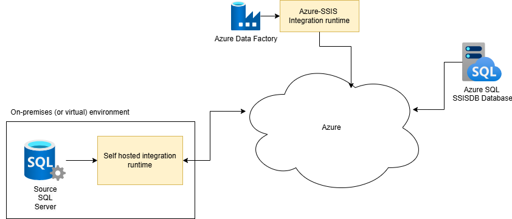
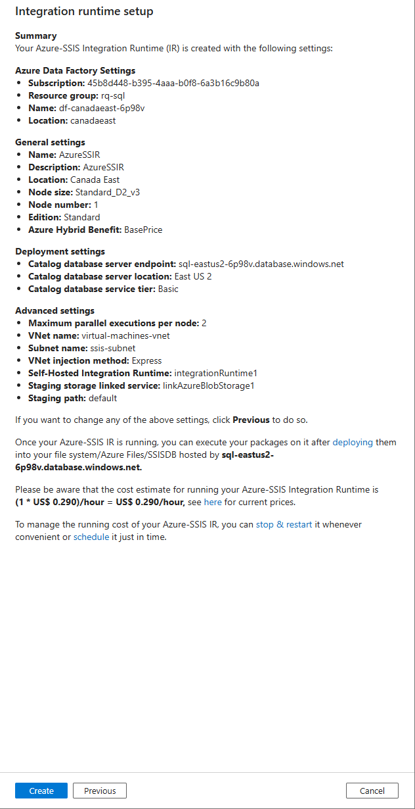

# Azure SSIS

This repository contains a project for executing an Azure Data Factory pipeline that moves data from an on-premises SQL Server to an Azure SQL database in the cloud.

The SSIS package used to move data to the cloud is stored in an SSISDB catalog.


## Azure Architecture




## References

- Quickstart: Create a Windows virtual machine in the Azure portal: https://learn.microsoft.com/en-us/azure/virtual-machines/windows/quick-create-portal
- Quickstart: Create a data factory by using the Azure portal: https://learn.microsoft.com/en-us/azure/data-factory/quickstart-create-data-factory
- Quickstart: Use the Azure portal to create a virtual network: https://learn.microsoft.com/en-us/azure/virtual-network/quick-create-portal
- Create and configure a self-hosted integration runtime: https://learn.microsoft.com/en-us/azure/data-factory/create-self-hosted-integration-runtime?tabs=data-factory

## Step-by-step walkthrough

### Installation

**Windows Server 2019 with SQL Server 2022 virtual machine**

Create a Windows Server 2019 with SQL Server 2022 virtual machine with a preset configuration.

Refer to the documentation for more details.

**Azure Data Factory**

Create a new Azure Data Factory instance in your Azure subscription


We will be accepting all the default options. Click on "Review+Create"


**Azure blob storage**

In this section, you will:
- create a Blob Storage (without namespace) for SSIS integration runtime
- give "Storage blob data contributor" permissions to ADF managed identity


**Self hosted integration runtime**

In Azure Data Factory Studio, create a Self-Hosted Integration runtime


Copy Key1 to your clipboard

**Install software pre-requisites in virtual machine**

1. Log into your virtual machine using Remote access
2. Install Visual Studio 2022 Community from https://learn.microsoft.com/en-us/visualstudio/install/install-visual-studio?view=vs-2022
4. Install the Microsoft Integration Runtime from https://www.microsoft.com/en-us/download/details.aspx?id=39717. Start the IR at the end of the installation process
5. Paste the key from your ADF Integration runtime and click Register


6. Click on Launch Configuration Manager


Your Integration Runtime in Azure Data Factory should now be running


7. Enable SSIS package execution by running this command in a prompt (in your on-prem server):

```sh
"\Program Files\Microsoft Integration Runtime\5.0\Shared\dmgcmd.exe" -EnableExecuteSsisPackage
```


**Create a link service to your on-prem SQL Server**

In Azure Data Factory Studio, create a new linked service to your source SQL Server


**Create a new linked service to your Azure blob storage**


Publish All if necessary


**Create a virtual subnet for SSIS with batch delegation**

- create a virtual network
- in this vnet, create a subnet for SSIS
- add batchAccounts delegation to this subnet


- create a linked service to this blob storage

**Create an Azure-SSIS IR**

If you have an SSISDB database already present in your target Azure SQL 
In ADF Studio, delete it.
Creating an Azure-SSIS Integration runtime as a proxy will create the SSISDB database for you.


- Check the box "Select a vnet for your Azure-SSIS integration runtime"
- Select your vnet, subnet, injection method (express)
- Check the box "Setup SHIR as a proxy"
- Select your storage linked service
- Click on the "Vnet validation" button


Click on "Continue" then on "Create"



The Azure-SSIS runtime will start right after the creation process is complete. Give it a few minutes and check the IR page in ADF studio


There should now be a new SSISDB database in your Azure SQL Server


**Create SSIS package**

In your VM, create a simple SSIS package that moves data from the local sql server to the Azure SQL database in the cloud.

In SSIS package, select the OLEDB connection that points to the ON-prem sql server and change the ConnectByProxy property to true


Execute the package locally to make sure it can copy data to the target Azure SQL database


**Publish to SSISDB**

- Right click on your Visual Studio project
- Select Deploy


Make sure SSIS in SQL Server is selected, click Next


Click on Browse


Create a new folder "ProductProject" and click OK


Click on Next, then Deploy


When the wizard completes, click the close button


Verify that your SSIS project (LoadAdventureWorks) is properly deployed on the target Azure SQL database


**Execute SSIS package from SSISDB**

- In your Integration Services Catalog, right-click on the LoadAdventureWorks project and select Execute package


**Execute SSIS package from ADF**

- Create an ADF pipeline


- Publish your pipeline
- Execute your pipeline 


- Click on Monitor to monitor execution progress


- After a few seconds, the pipeline executes completes


- The query in the Azure SQL database returns all the products !


